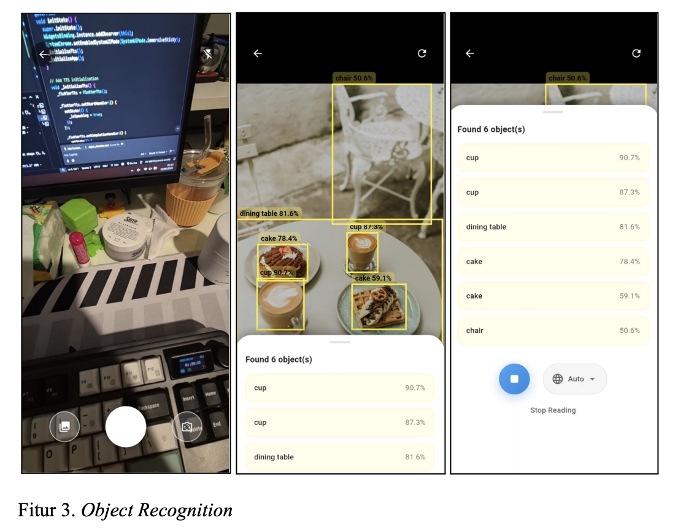
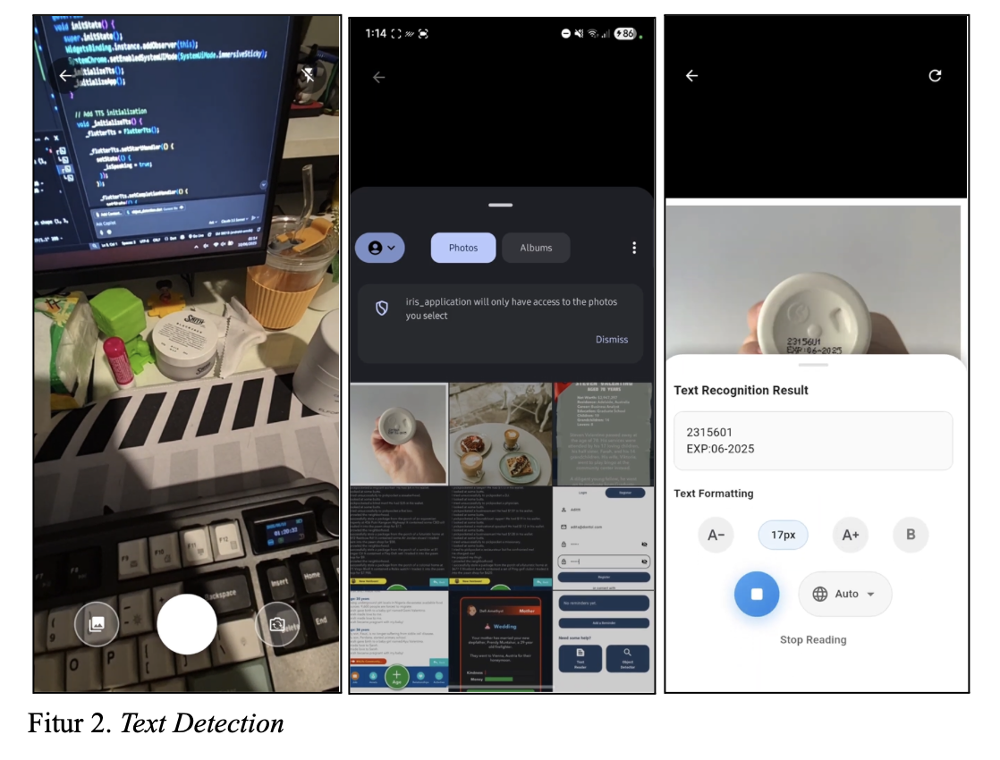
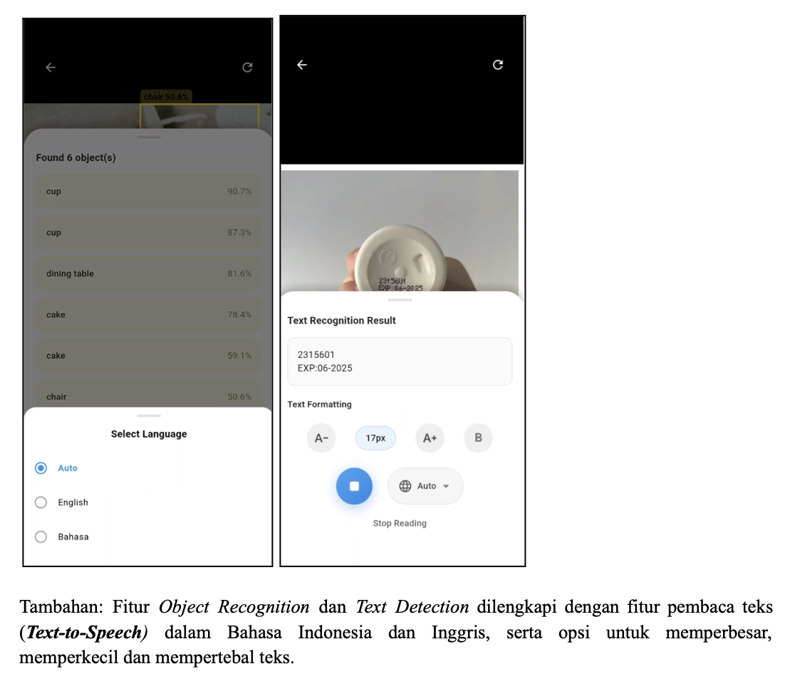

IRIS – Innovative Recognition for Impaired Sights 👁️📱

Empowering elderly and visually impaired users with AI-driven visual assistance.

---

📱 About the Project

IRIS is a mobile application built using Flutter, designed to assist elderly and visually impaired individuals in navigating daily life more independently. It utilizes state-of-the-art AI models for real-time object detection, text recognition, and text-to-speech conversion, providing accessible information from the user's environment via voice feedback.

---

Documentations





---

🎯 Key Features

- Object Detection using YOLOv11 (Ultralytics)
- Text Recognition (OCR) using Google Cloud Vision API
- Text-to-Speech (TTS) via Google Cloud TTS
- Voice Reminders for medication or daily tasks
- Emergency Button linked to predefined contacts
- Firebase Auth for secure login and user management
- Firestore Cloud DB for storing user preferences and history
- Flutter Framework for cross-platform Android/iOS support

---

🧪 Tech Stack

| Component        | Technology                  |
| ---------------- | --------------------------- |
| Mobile Framework | Flutter                     |
| Object Detection | YOLOv11 (Ultralytics)       |
| OCR API          | Google Cloud Vision         |
| TTS API          | Google Cloud Text-to-Speech |
| Backend/Auth     | Firebase Authentication     |
| Database         | Cloud Firestore             |
| Notifications    | Firebase Cloud Messaging    |
| Version Control  | Git + GitHub                |

---


---

Getting Started

Prerequisites

- Flutter SDK (3.0+)
- Firebase project set up with Auth & Firestore
- Google Cloud Vision & TTS API enabled
- Android Studio or VS Code

Installation

```bash
git clone https://github.com/valentypo/iris_application.git
flutter pub get

(to run the object detection backend)
cd iris-backend
python app.py

flutter run

